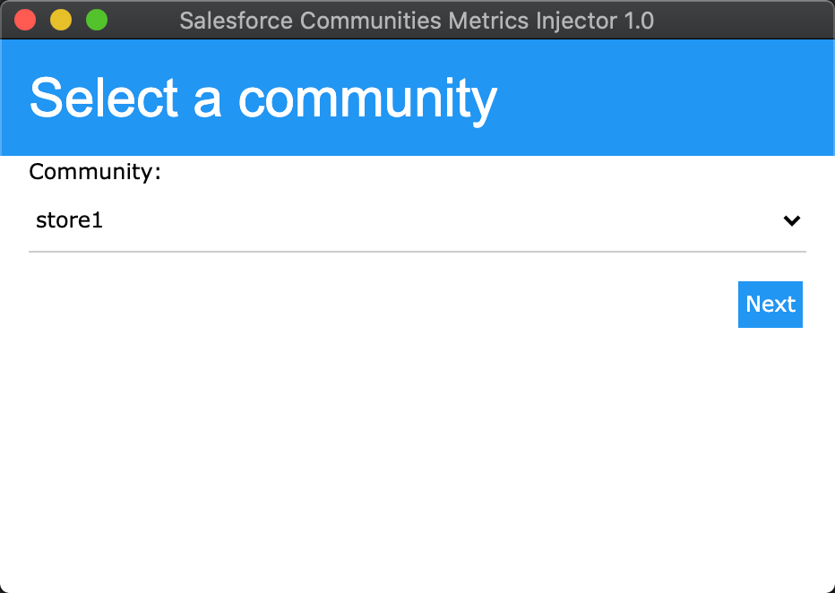

A tool to populate the "Service Community Scorecard" dashboard for a Salesforce Lightning Community.

Note that this tool requires the "Allow Salesforce Internal QA Clients" org perm to be enabled,
meaning that it will not work on a production org.

####Technology Stack
- Language: [TypeScript](https://www.typescriptlang.org)
- Backend: [NW.js](https://nwjs.io)
- Frontend: [w3.css](https://www.w3schools.com/w3css/defaulT.asp)

###Screenshots

